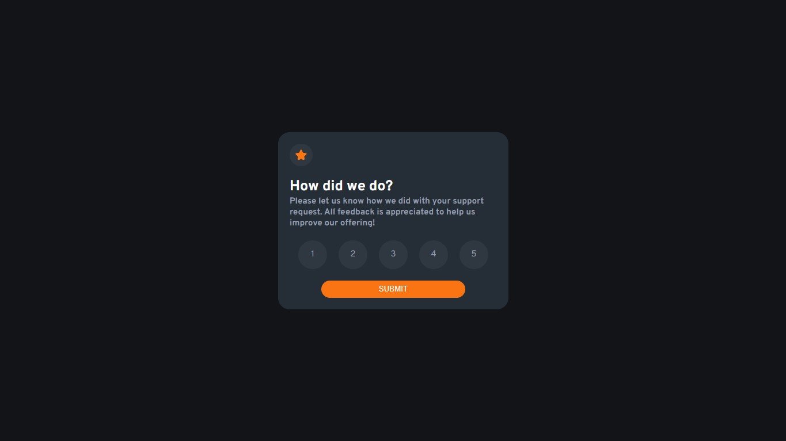

# Frontend Mentor - Interactive rating component solution

Esta é uma solução para o desafio [Interactive rating component challenge on Frontend Mentor](https://www.frontendmentor.io/challenges/interactive-rating-component-koxpeBUmI). Os desafios do Frontend Mentor ajudam você a melhorar suas habilidades de codificação criando projetos realistas.

### 🎯 O desafio

Os usuários devem ser capazes de:

- Veja o layout ideal para o aplicativo, dependendo do tamanho da tela do dispositivo
- Veja os estados de foco para todos os elementos interativos na página
- Selecione e envie uma classificação numérica
- Veja o estado do cartão "Obrigado" depois de enviar uma classificação

### 🔗 Links 

- [Solução no Frontend Mentor](https://www.frontendmentor.io/solutions/interactive-rating-component-l0Fu_Na9na)

- [Deployment no Github Pages](https://fransuelton.github.io/interactive-rating-component/)

### ✨ Tecnologias Utilziadas

- HTML5
- CSS
- Flexbox
- JavaScript

### 📚 Aprendizado

Com esse primeiro desafio de JavaScript, aprendi como manipular elementos e obter valores usando o DOM, além de fortalecer minha base em HTML e CSS.

### 🚀 Desenvolvimento contínuo

Agora estou aprendendo e aplicando JavaScript nos meus projetos. Estou fazendo exercícios do curso DevQuest e do Frontend Mentor, este foi o primeiro. Estou empolgado para aproveitar ao máximo essa linguagem incrível.

### 🙋 Autor

- Perfil no Linkedin - [Clique aqui.](https://www.linkedin.com/in/fransuelton/)
- Página no Frontend Mentor - [Clique aqui.](https://www.frontendmentor.io/profile/Fransuelton)